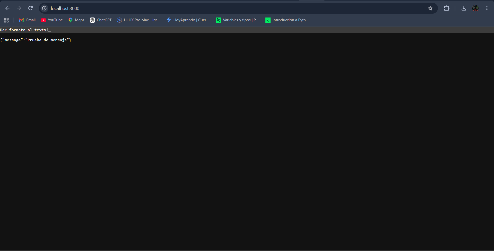
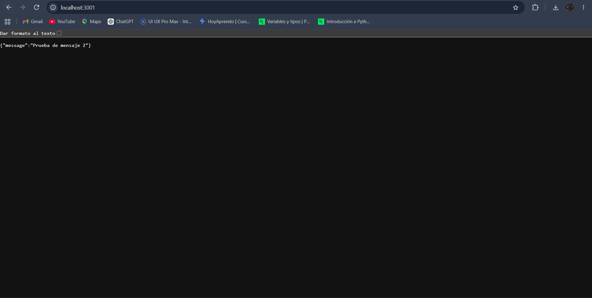
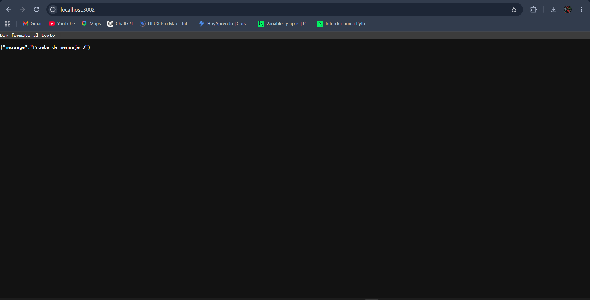
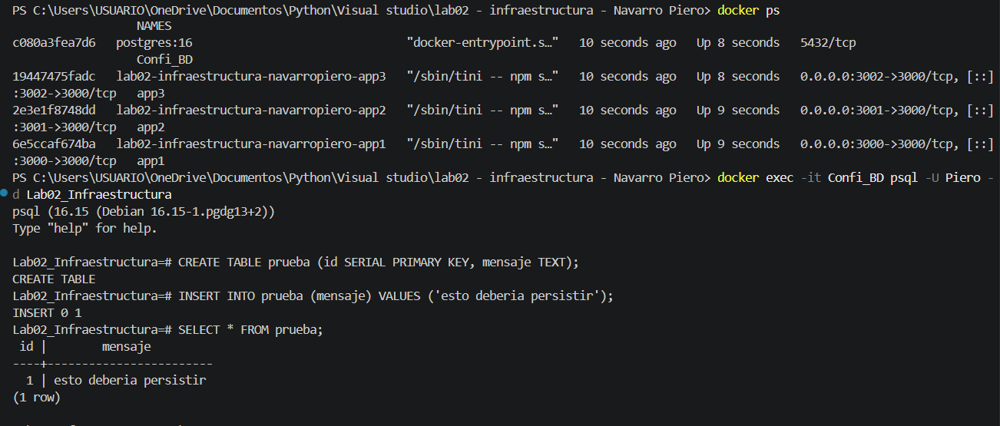
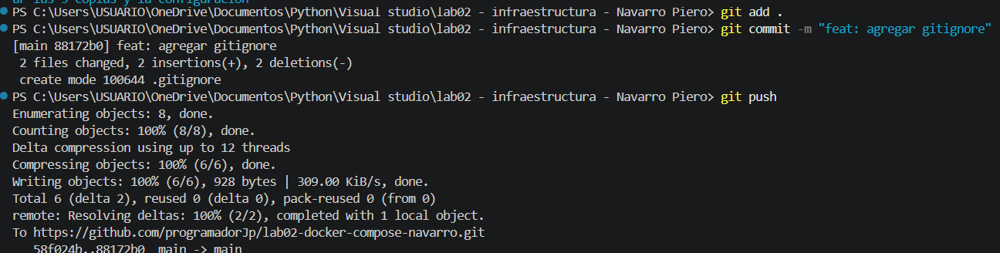
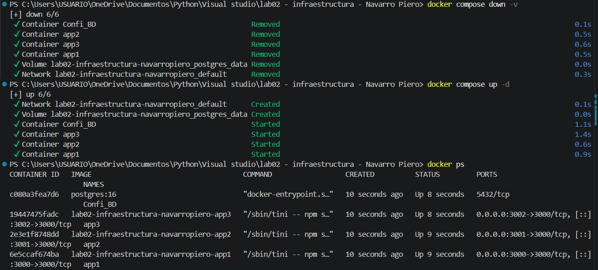

# Laboratorio 02 - Infraestructura como Código

## Estructura del proyecto

```
lab02-infraestructura/
├── api/
├── docker-compose.yaml
├── .gitignore
└── README.md
```

## Docker Compose

El archivo `docker-compose.yaml` tiene 3 instancias de la API `https://hub.docker.com/r/nmatsui/hello-world-api` y un contenedor de PostgreSQL:

```yaml
services:
  app1:
    build: ./api
    container_name: app1
    ports:
      - "3000:3000"
    environment:
      - MESSAGE=Prueba de mensaje

  app2:
    build: ./api
    container_name: app2
    ports:
      - "3001:3000"
    environment:
      - MESSAGE=Prueba de mensaje 2

  app3:
    build: ./api
    container_name: app3
    ports:
      - "3002:3000"
    environment:
      - MESSAGE=Prueba de mensaje 3

  db:
    image: postgres:16
    restart: always
    container_name: Confi_BD
    environment:
      - POSTGRES_USER=Piero
      - POSTGRES_PASSWORD=postgres
      - POSTGRES_DB=Lab02_Infraestructura
    volumes:
      - postgres_data:/var/lib/postgresql/data

volumes:
  postgres_data:
```

 Aquí cada instancia de la API es un servicio propio (`app1`, `app2`, `app3`), eso permite ver cada una a un puerto distinto del host (3000, 3001 y 3002) y darle un mensaje diferente por variable de entorno.

## Comandos utilizados

```bash

# Ejecutar los contenedores definidos en el docker-compose.yaml
docker compose up -d

# Elimina los contenedore 
docker compose down

# Borra los contenedores junto con el volumen
docker compose down -v

# Muestra los contenedores que estan corriendo 
docker ps

# Muestra todos los contenedores, incluso los detenidos
docker ps -a

# Lista los volumenes creados por Docker
docker volume ls

# Muestra el registro 
docker logs Confi_BD

# Entra a la consola de PostgreSQL dentro del contenedor
docker exec -it Confi_BD psql -U Piero -d Lab02_Infraestructura

```

## Verificación del funcionamiento

### 1. Probar cada instancia de la API

Con los contenedores arriba, cada instancia responde en su propio puerto:

```
http://localhost:3000
http://localhost:3001
http://localhost:3002
```


### 2. Probar la conexión a PostgreSQL

```bash
docker exec -it Confi_BD psql -U Piero -d Lab02_Infraestructura -c "SELECT current_database();"
```

### 3. Probar la persistencia del volumen

```bash
docker exec -it Confi_BD psql -U Piero -d Lab02_Infraestructura

CREATE TABLE estudiantes (id SERIAL PRIMARY KEY, nombre VARCHAR(50));
INSERT INTO estudiantes (nombre) VALUES ('Piero');

\q

docker compose down
docker compose up -d

docker exec -it Confi_BD psql -U Piero -d Lab02_Infraestructura -c "SELECT * FROM estudiantes;"
```


## Evidencia






# Creditos
- Navarro Zapata, Jean Piero